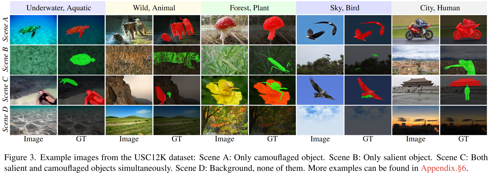

<h1 align="center">Rethinking Detecting Salient and Camouflaged Objects in Unconstrained Scenes</h1>

<div align='center'>
    <a href='https://scholar.google.com/citations?hl=zh-CN&user=lvx5k9cAAAAJ' target='_blank'><strong>Zhangjun Zhou</strong></a><sup> 1</sup>,&thinsp;
    <a href='https://scholar.google.com/citations?user=QUHsxCoAAAAJ&hl=en' target='_blank'><strong>Yiping Li</strong></a><sup> 1</sup>,&thinsp;
    <a href='https://scholar.google.com/citations?user=ai328a4AAAAJ&hl=en' target='_blank'><strong>Chunlin Zhong</strong></a><sup> 1</sup>,&thinsp;
    <a href='https://scholar.google.com/citations?user=fHAAbDUAAAAJ&hl=zh-CN' target='_blank'><strong>Jianuo Huang</strong></a><sup> 1</sup>,&thinsp;
    <a href='https://scholar.google.com/citations?user=1lPivLsAAAAJ&hl=en' target='_blank'><strong>Jialun Pei</strong></a><sup> 2</sup>,&thinsp;
    <a href='https://scholar.google.com.sg/citations?hl=zh-CN&user=0O2iY34AAAAJ&view_op=list_works&sortby=pubdate' target='_blank'><strong>Hua Li</strong></a><sup> 3</sup>,&thinsp;
    <a href='https://scholar.google.com/citations?hl=en&user=70XLFUsAAAAJ' target='_blank'><strong>He Tang</strong></a><sup> 1*</sup>
</div>


<div align='center'>
    <sup>1 </sup>Huazhong University of Science and Technology&ensp;  <sup>2 </sup>The Chinese University of Hong Kong&ensp;  <sup>3 </sup>Hainan University&ensp; 
</div>

<div align="center" style="display: flex; justify-content: center; flex-wrap: wrap;">
  <a href=''></a>&ensp; 
  <a href='https://arxiv.org/pdf/2412.10943'></a>&ensp; 
  <a href='https://github.com/ssecv/USCNet/blob/main/asset/Rethinking_Chinese_Version.pdf'></a>&ensp;  
  <a href=''></a>&ensp; 
  <a href=''></a>&ensp; 
  <a href='LICENSE'></a>&ensp; 
  <a href=''></a>&ensp; 
  <a href='t'></a>&ensp; 
</div>

<!-- 
<div align="center" style="display: flex; justify-content: center; flex-wrap: wrap;">
  <a href='https://colab.research.google.com/drive/14Dqg7oeBkFEtchaHLNpig2BcdkZEogba'></a>&ensp; 
  <a href='https://colab.research.google.com/drive/1MaEiBfJ4xIaZZn0DqKrhydHB8X97hNXl'></a>&ensp; 
  <a href='https://colab.research.google.com/drive/1B6aKZ3ekcvKMkSBn0N5mCASLUYMp0whK'></a>&ensp; 
</div>
 -->

This repo is the official implementation of "[**Rethinking Detecting Salient and Camouflaged Objects in Unconstrained Scenes**](https://arxiv.org/pdf/2412.10943)" (___ICCV 2025___).


<!-- 
[Zhangjun Zhou](https://scholar.google.com/citations?hl=zh-CN&user=lvx5k9cAAAAJ), [Yiping Li](https://scholar.google.com/citations?user=QUHsxCoAAAAJ&hl=en), [Chunlin Zhong](https://scholar.google.com/citations?user=ai328a4AAAAJ&hl=en), [Jianuo Huang](https://scholar.google.com/citations?user=fHAAbDUAAAAJ&hl=zh-CN), [Jialun Pei](https://scholar.google.com/citations?user=1lPivLsAAAAJ&hl=en), [Hua Li](https://scholar.google.com.sg/citations?hl=zh-CN&user=0O2iY34AAAAJ&view_op=list_works&sortby=pubdate), and [He Tang](https://scholar.google.com/citations?hl=en&user=70XLFUsAAAAJ)✉ 

[[Paper]](https://arxiv.org/pdf/2412.10943); [[Official Version]]()
 -->
 
**Contact:** hetang@hust.edu.cn; zhouzhangjun@hust.edu.cn

## Environment preparation

### Requirements
- **Please refer to the link: [SAM](https://github.com/facebookresearch/segment-anything).**
- You may need to install Apex using pip.

## Dataset preparation :fire:

### Download the datasets and annotation files

- USC12K: **[Baidu](https://pan.baidu.com/s/1JkJlNh0A4NI4_0elMmo5ug?pwd=9999)**/ **[Google](https://drive.google.com/file/d/1MIVCH7sLOzFwrzEDjKs2PSba7UpzLG7I/view?usp=sharing).**
- USC12K class files: **[Google](https://drive.google.com/file/d/10cQDz1b910D2JNNQfv--WbxOZXavQTZE/view?usp=sharing)**


### Register datasets

1. Download the datasets and put them in the same folder. To match the folder name in the dataset mappers, you'd better not change the folder names, its structure may be:

```
    DATASET_ROOT/
    ├── VOC-USC12K
       ├── ImageSets
          ├── Segmentation
              ├── Scene-A.txt
              ├── Scene-B.txt
              ├── Scene-C.txt
              ├── Scene-D.txt
              ├── train.txt
              ├── val.txt
       ├── JPEGImages
       ├── SegmentationClass

```



## Pre-trained models :
- Download the pre-training weights of SAM ViT-H: **[sam_vit_h_4b8939.pth](https://github.com/facebookresearch/segment-anythingv).** 
- Download the pre-trained weights on USC12K: **[Baidu](https://pan.baidu.com/s/1nOe2NNy8jcHLkFqpkwux8A?pwd=9999)**/ **[Google](https://drive.google.com/file/d/1xyuSi-h6qImgLanlty7Bk3e97eWDrDCc/view?usp=sharing).**

## Visualization results &#x26A1;


The visual results of  **SOTAs** on **USC12K test set**.
- Results on the Overall Scene test set: **[Baidu](https://pan.baidu.com/s/1f2W0x7LbR0Ueu3CufT3BLQ?pwd=9999)**/ **[Google](https://drive.google.com/file/d/1S-tz1u5eK7Ehy1gejyoC1ulEZnLiclWX/view?usp=sharing).**

## Usage

### Train&Test
- To train our USCNet on single GPU by following command,the trained models will be saved in savePath folder. You can modify datapath if you want to run your own datases.
```shell
bash train.sh
```
- To test and evaluate our USCNet on USC12K:
```shell
bash test.sh
```


## Acknowledgement

Additional thanks to the following contributors to this project: Huaiyu Chen, Weiyi Cui, Mingxin Yang, Mengzhe Cui, Fei Liu, Yan Xu, Haopeng Fang, and Xiaokai Zhang from the School of Software Engineering, Huazhong University of Science and Technology.

[//]: # (This work is based on:)

[//]: # (- [SAM]&#40;https://github.com/facebookresearch/segment-anything&#41;)

[//]: # ()
[//]: # (Thanks for their great work!)

## Citation

If this helps you, please cite this work:

```
@article{zhou2024unconstrained,
  title={Unconstrained Salient and Camouflaged Object Detection},
  author={Zhou, Zhangjun and Li, Yiping and Zhong, Chunlin and Huang, Jianuo and Pei, Jialun and Tang, He},
  journal={arXiv preprint arXiv:2412.10943},
  year={2024}
}
```

